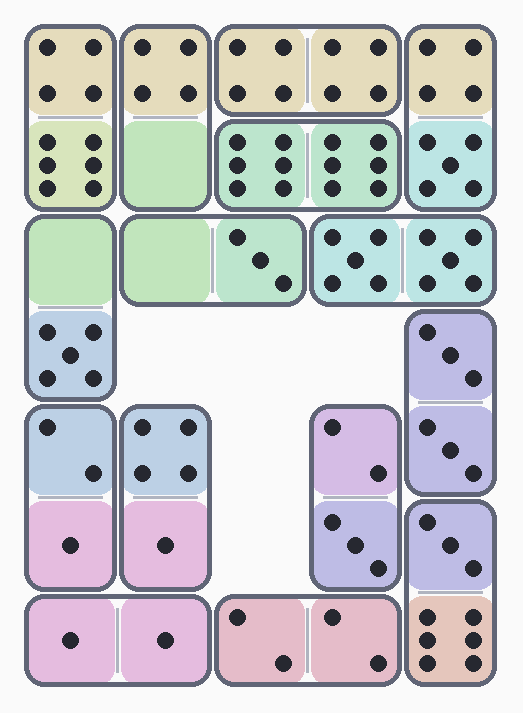

# Pips Solver

泛化 [NYT Pips](https://www.nytimes.com/games/pips) 骨牌謎題求解器。輸入盤面、限制與骨牌清單，自動找出所有合法的鋪排方式，並可輸出 PNG 圖片。



## 安裝

```bash
pip install pillow   # 僅出圖功能需要，求解本身不需要
```

Python 3.8+ 即可，無其他依賴。

## 使用方式

```bash
# 從檔案讀入
python pips_solver.py puzzle.txt

# 從 stdin 讀入
cat puzzle.txt | python pips_solver.py

# 輸出 PNG（預設前綴 solution，最多 3 張）
python pips_solver.py puzzle.txt -i

# 自訂前綴與張數
python pips_solver.py puzzle.txt -i result -n 5

# 出圖時為各限制區上淡色底
python pips_solver.py puzzle.txt -i -t
```

## 輸入格式

題目檔分三個區段，以 `# 區段名稱` 開頭、空白行分隔：

```
# 盤面
<row1>
<row2>
...

# 限制
<區域代碼> <限制形式>
...

# 骨牌
00 12 34 56 ...
```

### 盤面

每個字元代表一個格子：

| 字元 | 意義 |
|------|------|
| ` `（空白）或 `_` | 空缺，不放骨牌 |
| `*` | 放骨牌，但無任何限制 |
| 其他字元 | 屬於某限制區，相同字元＝同一區 |

行尾較短時，不足的部分自動補空白。

### 限制

每行格式：`<代碼> <限制形式>`

| 限制形式 | 意義 |
|----------|------|
| `=` | 區內所有格子點數必須全部相等 |
| `>N` | 區內點數總和 > N |
| `<N` | 區內點數總和 < N |
| `N` | 區內點數總和 == N |

### 骨牌

一行，每個 2 字元 token 代表一張骨牌的兩面點數（0–6），骨牌可翻轉。

```
# 骨牌
00 01 02 03 04 05 06 11 12 13 14 15 16 22 23 24 25 26 33 34 35 36 44 45 46 55 56 66
```

## 範例題目

```
# 盤面
AABB
CCDD

# 限制
A 3
B =
C >2
D <5

# 骨牌
12 33 24 15
```

執行：

```
python pips_solver.py puzzle.txt -i -t
```

或以 repo 內的現有的題目為例

```
python pips_solver.py 20260612.txt -i -t
```


## 輸出說明

- 找到解時印出每組解的盤面格局與各骨牌位置。
- 預設最多顯示 3 組解，最多搜尋 100 組。
- 若解數達上限，會提示「已達上限，可能更多」。
- `-i` 旗標可將解輸出為 PNG，骨牌以圓角磚塊＋骰子點數呈現；`-t` 旗標加上區域淡色底。

## 命令列參數

| 參數 | 說明 |
|------|------|
| `input` | 題目檔路徑（省略則從 stdin 讀） |
| `-i PREFIX`, `--image PREFIX` | 輸出 PNG，檔名為 `PREFIX_1.png`…，預設前綴 `solution` |
| `-t`, `--tint` | 出圖時為各限制區上淡色底 |
| `-n N`, `--num-images N` | 最多輸出幾張解圖（預設 3） |
